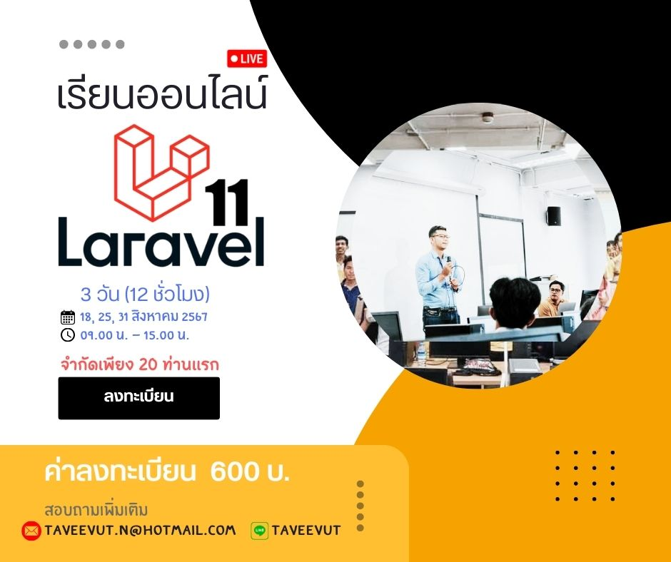

# สร้างเว็บแอปพลิเคชันด้วย Laravel Framework
> รายละเอียดเพิ่มเติม [คลิก](https://bit.ly/3WTNNAQ)

- คอร์สเรียนออนไลน์, 3 วัน (12 ชั่วโมง)
- ตั้งแต่วันที่ 18, 25, 31 สิงหาคม 2567 เวลา 09.00 น. - 15.00 น.
- รับจำนวน 20 คน (จำนวนจำกัด)
- ค่าละทะเบียน 600 บาท
- โอนเงิน ธนาคารกรุงไทย เลขที่บัญชี `909-0-86746-5` ชื่อบัญชี `นายทวีวุฒิ นากอหม๊ะ`
- ลงทะเบียน [คลิก](https://forms.office.com/r/CHDf5BcKW6)
## ติดต่อและหลักฐานการโอนเงิน
- Line ID: taveevut Email : taveevut.n@hotmail.com หรือ สอบถามข้อมูลเพิ่มเติมที่ 086-2887987
- อุปกรณ์ที่ต้องเตรียม Labtop ส่วนตัว ระบบปฏิบัติการ Windows, OS Mac, Linux
- `หมายเหตุ หากมีการเปลี่ยนแปลงจะแจ้งให้ทราบ ก่อนเรียน`

